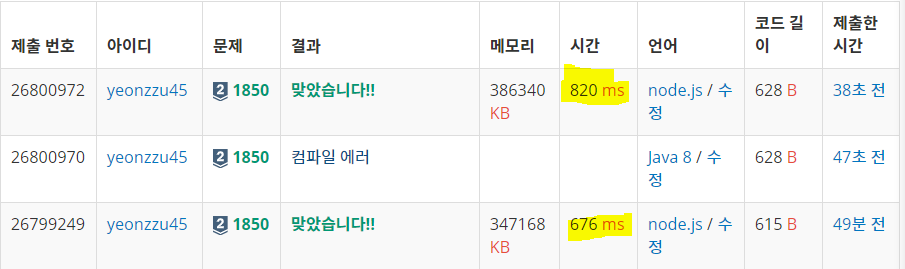

# 1850번 최대공약수

[문제 보러가기](https://www.acmicpc.net/problem/1850)

| 난이도 | 정답률(\_%) |
| :----: | :---------: |
| Silver II | 30.706% |

## 설계
#### "두 수에 대한 최대 공약수와 두 수를 이루는 1의 개수 최대공약수와 동일"

## 정리

| 내 코드 (ms) |
| :----------: |
|     676      |

## 후기 및 알게된 점
- [유클리드 호제법](http://xn--299as6vb5i1je.com/interview/50)

> 어떤 임의의 수 **a, b**에 대해 **a mod b = r** 이라고 한다면 **gcd(a,b) = gcd(b,r)**이 성립한다는 점을 이용합니다. 이렇게 반복하면서 최종적으로 **나머지가 0이 되는 순간** 그 **나누는 수가 최대공약수**가 됩니다.
>
> ex) GCD(24,16) -> GCD(16,8) -> GCD(8,0) : 최대공약수 = 8

##### 	[유클리드 호제법 장점](https://coding-factory.tistory.com/599)

> 유클리드 호제법의 장점은 **빠르다**는 것입니다. 일반적으로 최대공약수를 구하는 가장 쉬운 방법은 <u>2부터 min(A, B)까지 모든 정수로 나누어 보는 방법</u>이 있을 것 같은데 이의 경우 모든 정수를 나눠야 하므로 **시간 복잡도는 O(N)**이 됩니다. 하지만 유클리드 호제법을 사용한다면 비교대상의 두 수 a와 b에서 a를 b로 나눈 나머지를 r이라고 했을 때 a % r이 0이 될 때까지 반복을 해주는 방식으로 최대공약수를 산출하기에 시간 복잡도를 **O(log N)**으로 줄일 수 있어 좀 더 효율적인 알고리즘을 작성할 수 있습니다.

```javascript
const lcm = (a, b) => (a * b / gcd(a,b));
```

- [BigInt 자료형](https://velog.io/@baemjoon/%EC%9E%90%EB%B0%94%EC%8A%A4%ED%81%AC%EB%A6%BD%ED%8A%B8%EC%97%90%EC%84%9C-%EC%95%84%EC%A3%BC-%ED%81%B0-%EC%88%98-%EB%8B%A4%EB%A3%A8%EA%B8%B0-BigInt-7fk5kmrh0n)

- ``fill()`! ! `Array()`으로만 배열초기화가 되지 않는다

  코딜리티 풀 때, `Array(n).fill().map(()=>true)`으로 했을 때 시간초과가 나서 `Array(n).fill(true)`으로 바꿨더니 통과가 됐었는데.. `Array(n).fill().map()`은 이중포문이랑 시간복잡도가 같은 것 같다!

  아래 제출 현황을 보면 for문을 썼을 때와 Array.fill.forEach를 썼을 때의 실행시간 차이를 알 수 있다. 



```javascript
// 비교 1 (820ms)
Array(_n)
    .fill()
    .forEach(() => answer.push(1));

// 비교 2 (676ms)
for (let i = 0; i < _n; i++) answer.push(1);
```

