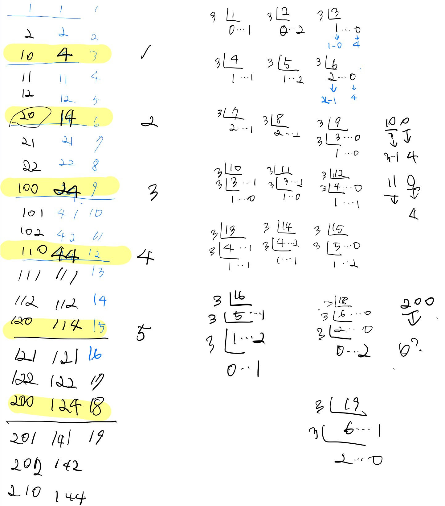

# 12899번 124 나라의 숫자  

[문제보기](https://programmers.co.kr/learn/courses/30/lessons/12899)

## 설계

### "3진법에서 규칙 추가.나머지가 1, 2일 경우는 3진법과 124나라 숫자는 같다.하지만 나머지가 0일 때만 숫자가 달라진다. 3진법은 124숫자보다 먼저 자릿수 증가한다"



<br/>

N을 3으로 나눈 나머지가 0일때는 4, 1일때는 1, 2일때는 2가 된다. n%3에 대체되는 124 숫자를 넣어준다.
```javascript
answer = [base[n % 3], ...answer];
```
그 다음 n은 나머지가 0일때는 몫에서 1만큼 뺀 수가 되고 나머지 1, 2일때는 몫이 된다.
 ```javascript
n = n % 3 === 0 ? n / 3 - 1 : Math.floor(n / 3);
```
## 후기