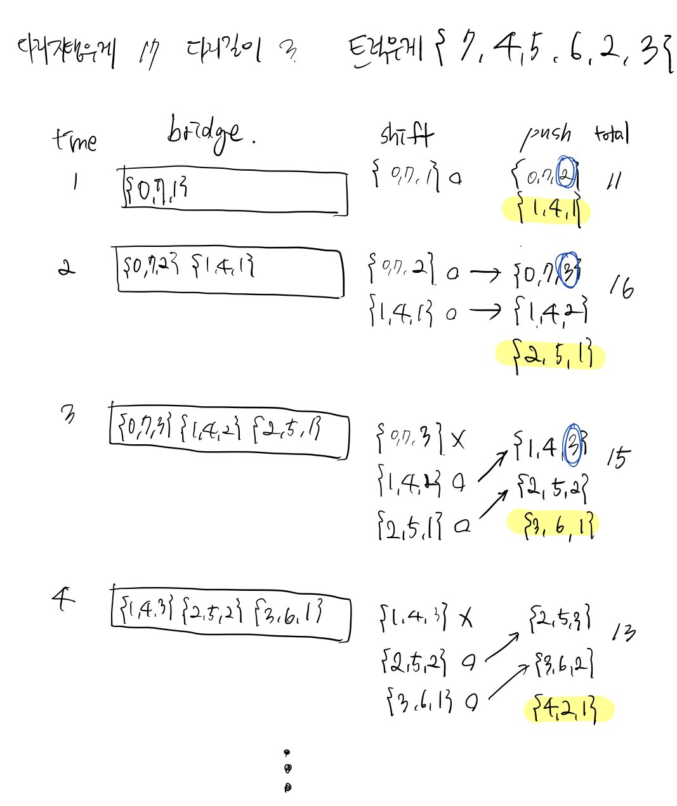

# 42583번 다리를 지나는 트럭 

[문제보기](https://programmers.co.kr/learn/courses/30/lessons/42583)

## 설계



### "다리 위에 있는 트럭을 큐로 관리하기"

1. 모든 트럭에 대해서 초기화

- **trucks**: trucks_weight에 대응하는 truck 객체를 저장하는 배열

    truck 객체(Object)
   - **index**: 주어진 truck_weights 배열에서 트럭의 순서를 저장하는 프로퍼티
   - **weight**: 트럭 무게를 저장하는 프로퍼티
   - **location**: 다리 위에서 해당 트럭의 현재 위치 정보를 저장하는 프로퍼티

```javascript
const trucks = truck_weights.map((weight, index) => ({
    index: index,
    weight: weight,
    location: 1,
}));
```
> 💛 locationa을 1로 초기화하는 이유
>
> 트럭이 다리 위에 올라가면 location이 1이 되기 때문에 1로 초기화해주었다. 

<br/>

2. 시간의 흐름에 따라 다리 위에 있는 트럭 확인하기
- **bridge** : 현재 다리 위에 있는 트럭 객체를 저장하는 배열
        
    bridge 배열은 **queue**로 사용할 것이다.

- **seconds** : 모든 트럭이 다리 위를 건널 때까지 걸리는 시간을 세고 저장하는 변수

    Queue인 bridge에 트럭이 없을 때까지 반복문을 순회한다. 
    
    #1 변수 정의

    반복문에서 현재 다리 위에 있는 트럭의 개수, 다음 트럭의 인덱스, 다리 위에 있는 모든 트럭의 무게에 대해서 확인하고 관리한다.
    - **number**:  현재 다리 위에 있는 트럭의 개수를 저장하는 변수
    - **next**: 다음 트럭의 인덱스
    - **totalWeight** : 다리 위에 있는 모든 트럭의 무게

    #2 현재 다리 위에 있는 모든 트럭 확인
    
    shift 함수로 Queue인 bridge에 있는 truck 객체를 하나씩 순차적으로 뽑는다. 현재 뽑힌 트럭 객체는 now 변수에 저장된다. 
    
    현재 트럭이 다리를 다 지났는지 확인한다. 즉, 현재 트럭 now의 위치 location이 다리 길이 bridge_length와 동일한지 확인한다. **동일하면 현재 트럭이 다리를 다 건넜**기 때문에 bridge에 추가하지 않는다. 
    
    이와 반대로 **현재 트럭의 위치가 다리의 길이와 동일하지 않았다면 트럭이 다리를 다 건너지 않았다**는 말이다. 다리에 올라가 있는 전체 트럭의 무게를 체크하기 위해 totalWeight에 현재 트럭의 무게를 누적한다. 그리고 현재 트럭의 위치를 1 증가시켜 bridge에 추가해준다.

    #3 다음 트럭이 다리 위에 올라올 수 있는지 확인
    현재 트럭을 기준으로 다음 트럭이 있는지 확인한다. 다음 트럭이 있다면, 현재 다리 위에 있는 트럭의 무게에 다음 트럭의 무게를 더한 값이 다리가 지탱할 수 있는 무게와 비교한다. 전자가 후자보다 작거나 같을 때 다음 트럭을 bridge에 추가한다.  

```javascript
let bridge = [trucks[0]];
let seconds = 1;
while (bridge.length) {

    //#1 변수 정의
    const number = bridge.length;

    const next = bridge[number - 1].index + 1;
    let totalWeight = 0;

    //#2 현재 다리 위에 있는 모든 트럭 확인
    for (let i = 0; i < number; i++) {
      let now = bridge.shift();

      if (now.location === bridge_length) continue;

      totalWeight += now.weight;
      bridge.push({ ...now, location: now.location + 1 });
    }

    //#3 다음 트럭이 다리 위에 올라올 수 있는지 확인
    if (next < trucks.length && totalWeight + trucks[next].weight <= weight) {
      bridge.push(trucks[next]);
    }


    //#4 시간 증가
    seconds++;
}
```

## 새롭게 알게되거나 공유해서 알게된 점
- 승영님과 코드 리뷰 진행 중 얻은 Aha ~
    - shift함수의 시간복잡도는 O(n)이고 pop의 시간복잡도는 O(1)이기 때문에 배열에서 뽑고 넣고하는 경우가 잦을 때는 reverse() 를 이용해서 stack으로 진행하는 편이 좋다고.. 그래서 truck_weight를 reverse하셔서 truckWeight로 관리하셨다.
    - 다리에 지나가기 전인 트럭들의 대기열인 스택 truckWeight와 현재 다리 위에 있는 트럭들의 큐인 bridge를 따로 두셨다. **다리 위에 다음 트럭이 올라오지 못했을 때는 0을 bridge에 push**하시는 방식으로 풀이하셨다. 이 때 좋은 점은 큐인 bridge에서 하나씩 확인할 때 0이면 bridge에 추가하지 못한 상태를 체크하고 시간을 증가시킬 수 있다는 점인 것 같다.


## 고생한 점
- ㅎ힘들었다...
- `=` 을 안 붙여서 다리가 지탱할 수 있는 무게와 동일해졌을 때 다음 트럭 객체를 bridge에 추가되지 않아 틀렸습니다를 계속 보는 슬픈 일이 반복됐다.