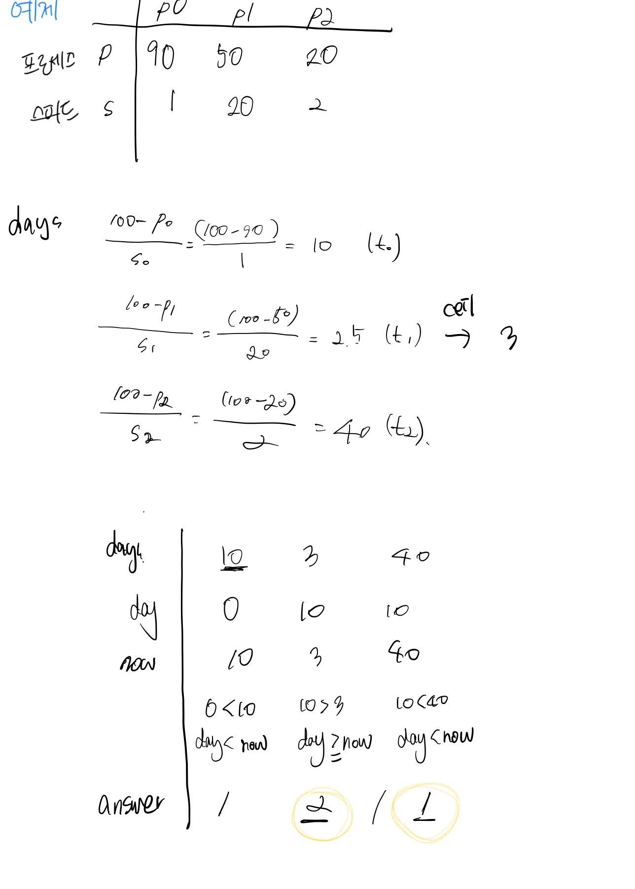

# 42586번 기능개발 

[문제보기](https://programmers.co.kr/learn/courses/30/lessons/42586)

## 설계



### "순서대로 각 작업에 대한 수행시간 비교하기"

1. 모든 작업에 대한 수행 시간 구하기

    작업은 100%가 되면 수행 완료된다.
    -  progresses 작업진도는 각 작업별로 현재까지 개발된 진도를 저장하는 배열
    - speed는 작업속도를 저장하는 변수

    각 작업에 대한 남은 작업시간을 저장하는 days 배열을 구했다. 공식은 `(100 - 작업진도) / 작업속도` 이다.
    
```javascript
let days = progresses.map((progress, index) => {
    return Math.ceil((100 - progress) / speeds[index]);
  });
```

2. 모든 작업에 대한 수행 시간 비교하기
- day: 현재까지 확인한 최대 작업 기간을 저장하는 변수
- answer: 각 배포마다 몇 개의 작업이 배포되는지 저장하는 배열

반복문을 통해 앞서 구한 days 배열을 순회한다. shift함수를 써서 days 배열의 맨 앞에 있는 값을 가져온다. 

- now: 현재 작업에 대한 남은 작업 기간

현재 작업에 대한 남은 작업 기간 now와 현재까지 확인한 최대 작업 기간 day를 비교한다. now가 day보다 크다는 것은 현재 작업이 앞서 진행한 작업보다 일찍 끝났다는 것이다. 그러므로 함께 배포할 수 있기 때문에 1을 증가한다.

반면에 now가 day보다 작다는 것은 현재 작업이 이전 작업보다 더 오래 걸리기 때문에 이전 작업과 같이 배포할 수 없다는 것을 의미한다. 따라서 현재 작업을 새로 배포하는 것을 count해야하므로 answer에 1을 새로 추가한다. 또한 day를 now로 바꿔준다.

```javascript
let day = 0;
let answer = [];

while (days.length) {
  let now = days.shift();

  if (now > day) {
    answer.push(1);
    day = now;
    continue;
  }
  answer[answer.length - 1]++;
}
return answer;
```

## 새롭게 알게되거나 공유해서 알게된 점


## 고생한 점
