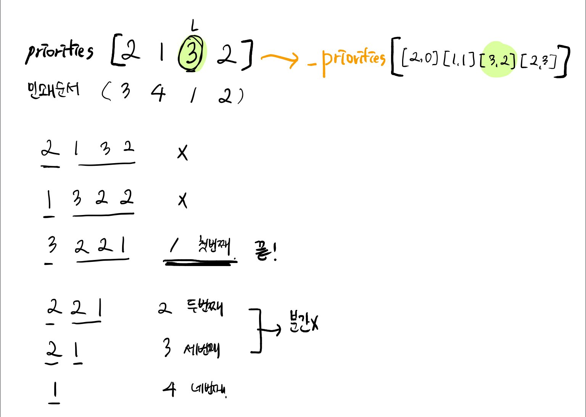

# 42587번 프린터 

[문제보기](https://programmers.co.kr/learn/courses/30/lessons/42587)

## 설계


1. 인쇄 priorites 배열을 _priorities로 재정의
_priorities 배열에 문서의 처음 위치와 문서의 중요도를 같이 넣는다.
```javascript
 const _priorities = priorities.map((val, idx) => [val, idx]);
```

2. _priorities 배열의 길이가 0이 될 때까지 반복
- now: 현재 _priorites 배열의 맨 앞 문서 

현재 꺼낸 문서 now의 우선순위보다 더 큰 우선순위를 가진 문서가 존재하면 현재 꺼낸 문서 now는 _priorites배열 맨 뒤에 넣는다.

만약 현재 꺼낸 문서의 우선순위보다 더 큰 우선순위를 가진 문서가 없다면 count를 증가시킨다. 

현재 꺼낸 문서가 뽑고자 하는 문서(location)이면 반복을 종료한다.

```javascript
 while (_priorities.length) {
    let now = _priorities.shift();
    if (_priorities.filter((val) => val[0] > now[0]).length > 0) {
      _priorities.push(now);
      continue;
    }
    count++;
    if (now[1] === location) return count;
  }
```
## 새롭게 알게되거나 공유해서 알게된 점


## 고생한 점
