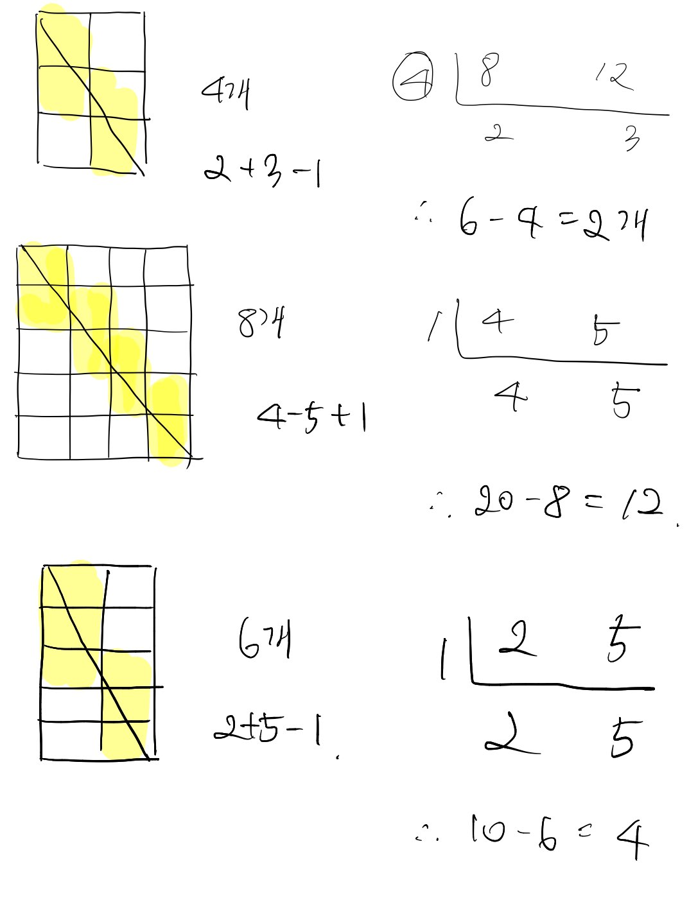

# 62048번 멀쩡한사각형 

[문제보기](https://programmers.co.kr/learn/courses/30/lessons/62048)

## 설계
### "직접 그려보는게 답인가"




<br/>

```
1. 세로길이와 가로길이에 대한 최대공약수를 구한다.

2. 세로길이와 가로길이에 최대공약수로 나눈 두 값을 이용하여 멀쩡하지 않은 사각형 개수를 구한다.

3. 멀쩡하지 않은 사각형 개수를 최대공약수만큼 곱해서 주어진 가로길이와 세로길이에 대한 멀쩡하지 않은 사각형 총합을 구한다.

4. 세로길이와 가로길이에 대한 모든 1x1 사각형의 개수에 멀쩡하지 않은 사각형 총합을 뺀다.  
```

### 1. 유클리드 호제법을 이용한 최대공약수 구하기

```javascript
function solution(w,h){
   const gcd = w > h ? GCD(w, h) : GCD(h, w);
   ...
}

function GCD(a, b) {
  while (b > 0) {
    let temp = b;
    b = a % b;
    a = temp;
  }
  return a;
}
```

### 2. 2,3,4 단계 적용


```javascript
function solution(w, h) {
  ...
  return w * h - gcd * (w / gcd + h / gcd - 1);
}
```


## 후기
- 유클리드 호제법 복기
