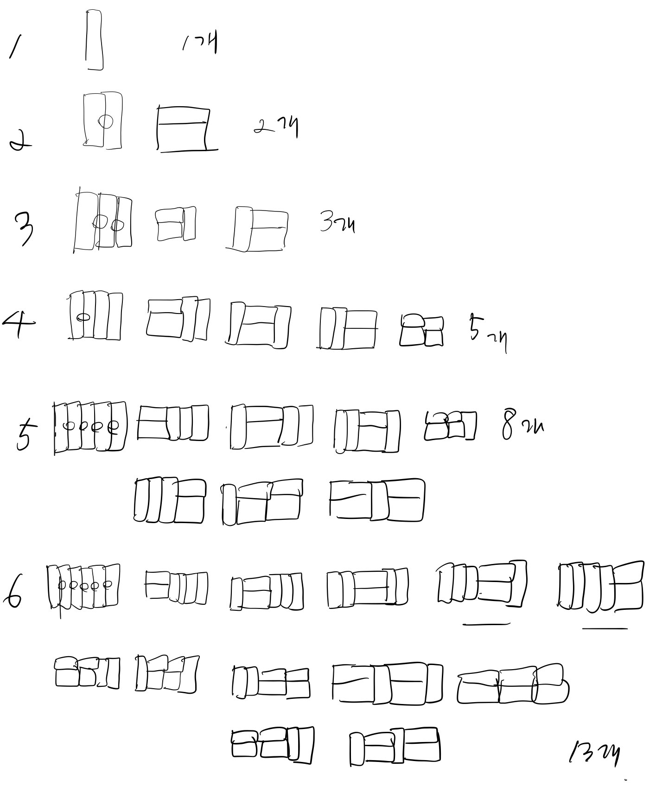

# 12900번 2 x n 타일링

[문제보기](https://programmers.co.kr/learn/courses/30/lessons/12900)

## 설계
그림을 그려보았다....

## 새롭게 알게되거나 공유해서 알게된 점

## 고생한 점
- 하나씩 그려보니 피보나치인 걸 알게되었는데 수학과인 민규오빠한테 물어보았더니... 쏘 ez한 문제아냐?...그렇다고 들었다.. 많이 풀어봐서 점화식을 빨리 구할 수 있는 눈썰미를 길러야겠다..