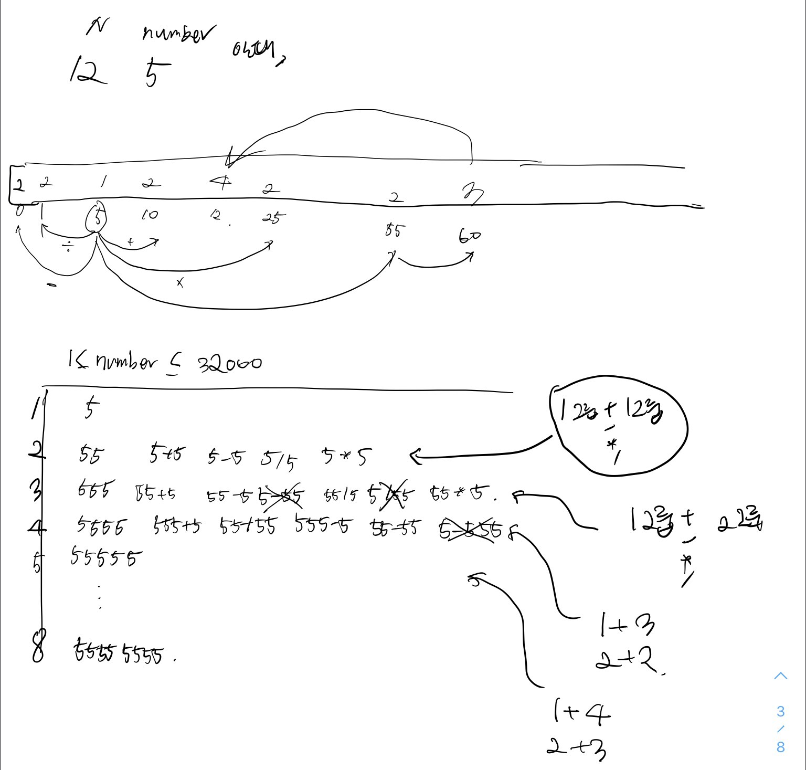
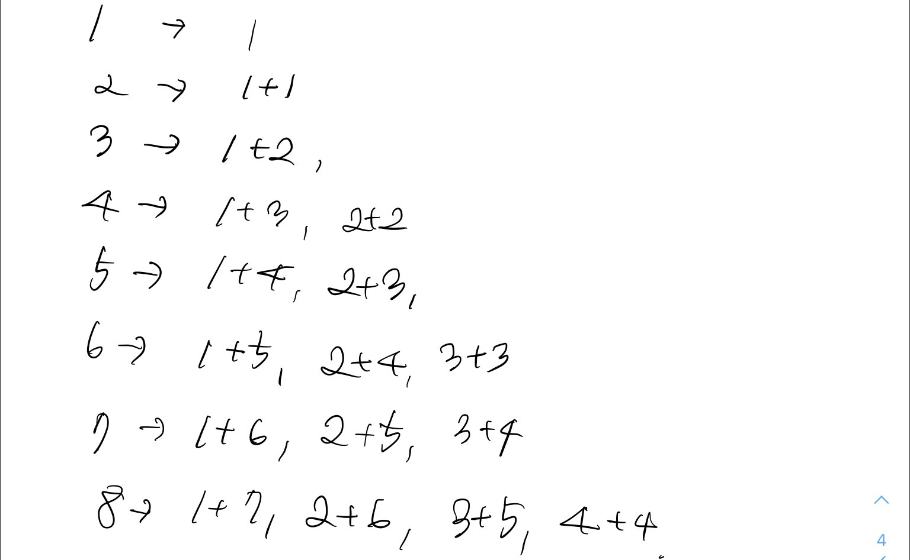

# 42895번 N으로 표현

[문제보기](https://programmers.co.kr/learn/courses/30/lessons/42895)

## 설계




### 1. 숫자 N을 사용한 회수에 따라 1에서 8까지 나눈 그룹 초기화
**1번째 그룹** : [5]
**2번째 그룹** : [55]
**3번째 그룹** : [555]
**4번째 그룹** : [5555]
 ...
**8번째 그룹** : [55555555]


```javascript
const getGroups = (N) =>
  Array(8)
    .fill(null)
    .map((_, idx) => {
      return [+String(N).repeat(idx + 1)];
    });

//출력
//[
// [ 5 ],
//  [ 55 ],
//  [ 555 ],
//  [ 5555 ],
//  [ 55555 ],
//  [ 555555 ],
//  [ 5555555 ],
//  [ 55555555 ]
//]
```

### 2. 8개 그룹에 대한 모든 숫자 N 사용횟수 경우의 수 찾기

**1 번째 그룹** : 없음

**2 번째 그룹** : 1번째 그룹 + 1번째 그룹 (숫자 N 1회 사용 + 숫자 N 1회 사용)

**3 번째 그룹** : 1번째 그룹 + 2번째 그룹 (숫자 N 1회 사용 + 숫자 N 2회 사용)

**4 번째 그룹** : 1번째 그룹 + 3번째 그룹, 2번째그룹 + 2번째그룹 (숫자 N 1회 사용 + 숫자 N 3회 사용, 숫자 N 2회 사용 + 숫자 N 2회 사용)

**5 번쨰 그룹** : 1번째 그룹 + 4번째 그룹, 2번째그룹 + 3번째그룹(숫자 N 1회 사용 + 숫자 N 4회 사용, 숫자 N 2회 사용 + 숫자 N 3회 사용)

...


```javascript
const getCases = () =>
  Array(8)
    .fill(null)
    .map((_, idx) => {
      if (idx + 1 === 1) return null;
      const cases = [];
      const mid = Math.floor((idx + 1) / 2);
      Array(mid)
        .fill(null)
        .forEach((_, i) => {
          cases.push([i + 1, idx - i]);
        });
      return cases;
    });

// 출력
// [
//   null,
//   [ [ 1, 1 ] ],
//   [ [ 1, 2 ] ],
//   [ [ 1, 3 ], [ 2, 2 ] ],
//   [ [ 1, 4 ], [ 2, 3 ] ],
//   [ [ 1, 5 ], [ 2, 4 ], [ 3, 3 ] ],
//   [ [ 1, 6 ], [ 2, 5 ], [ 3, 4 ] ],
//   [ [ 1, 7 ], [ 2, 6 ], [ 3, 5 ], [ 4, 4 ] ]
// ]
```

  

### 3. 순차적으로 8개 그룹에 속한 숫자들을 구하고 number가 있는지 확인하기

```javascript
function solution(N, number) {
  ...
  for (let i = 1; i < 8; i++) { // 2번째(index가 1인) 그룹부터 확인
    for (let j = 0; j < cases[i].length; j++) { // 해당 그룹에 대한 숫자 N을 사용하는 경우의 수만큼 확인
      const [c1, c2] = cases[i][j]; // c1: 그룹1 , c2: 그룹2
      groups[i] = new Set([         
        ...groups[i],
        ...getCombination(groups[c1 - 1], groups[c2 - 1]),
      ]);
      groups[i] = [...groups[i]];
      if (groups[i].includes(number)) { // number가 포함되는지 확인
        return i + 1;
      }
    }
  }
  return -1;
}
```

조합을 이용하여 2개의 각 그룹에 속한 numbers에 대한 사칙연산을 하였다.  

```javascript
const getCombination = (a, b) => {
  let result = [];
  for (let i = 0; i < a.length; i++)
    for (let j = 0; j < b.length; j++) {
      const numbers =
        a[i] > b[i] ? getNumbers(a[i], b[j]) : getNumbers(b[j], a[i]); // 사칙연산을 진행한 결과값을 들고옴 (a>b)
      result.push(...numbers);
    }
  return result;
};
```

```javascript
const getNumbers = (a, b) => {
  let numbers = [];
  ["+", "-", "*", "/"].map((operator) => {         // 사칙연산 진행
    const result = calculate(operator, a, b);
    0 <= result &&
      result < MAX_NUM &&
      Number.isInteger(result) &&
      numbers.push(result);
  });
  return numbers;
};
```

사칙연산에 필요한 변수를 따로 정의하였다.

```javascript
const MAX_NUM = 32000;

const operation = {
  "+": (x, y) => x + y,
  "-": (x, y) => Math.abs(x - y),
  "*": (x, y) => x * y,
  "/": (x, y) => x / y,
};

const calculate = (operator, number1, number2) =>
  operation[operator](number1, number2);
```

> (예시) N = 5, number = 1010일 때 
>
> ======================================
>
> **2번째 그룹** [ [ 1, 1 ] ]
>
> 1번째 그룹 [ 5 ] + 1번째 그룹 [ 5 ]
>
> combinations---------------------
>
> [ 10, 0, 25, 1 ]
>
> \-----------------------------------------
>
> **2번째 그룹 numbers**  
>
> [ 55, 10, 0, 25, 1 ]
>
> ======================================
>
> **3번째 그룹** [ [ 1, 2 ] ]
>
> 1번째그룹 [ 5 ] + 2번째 그룹 [ 55, 10, 0, 25, 1 ]
>
> combinations---------------------

> [ 60, 50, 275, 11 ]
>
> [ 15, 5, 50, 2 ]
>
> [ 5, 5, 0, 0 ]
>
> [ 30, 20, 125, 5 ]
>
> [ 6, 4, 5 ]
>
> \-----------------------------------------
>
> **3번째 그룹 numbers**
>
> [
>   555, 60, 50, 275, 11,  15,
>     5,  2,  0,  30, 20, 125,
>     6,  4
> ]
>
> ======================================
>
> ...
>
> ...

## 새롭게 알게되거나 공유해서 알게된 점


## 고생한 점
- 그룹별로 경우의 수를 뽑아내고 ... 등등 다른 분의 풀이를 보면 내가 문제를 항상 너무 복잡하게 생각하나 이런 생각이 들었다.  이것도 아직 문제를 많이 안풀어봐서 그런거 같다! 
- 사칙연산 중 빼기에서 문제가 생겨서 테스트케이스 1개가 통과하지 못했다. Math.abs()로 절대값이 되도록 처리를 해주니 pass가 되었다
