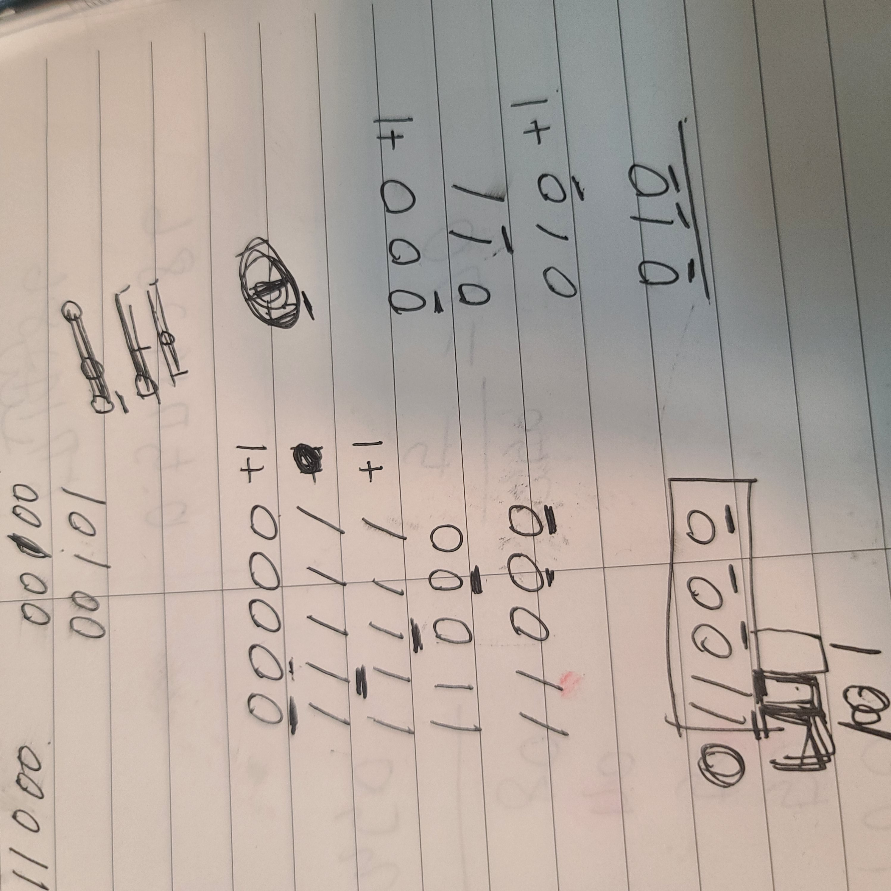

## 1289. 원재의 메모리 복구하기 

[문제보기](https://swexpertacademy.com/main/code/problem/problemDetail.do?contestProbId=AV19AcoKI9sCFAZN)

**## 설계**

**## 새롭게 알게되거나 공유해서 알게된 점**

**## 고생한 점**

\- skill이 주어지는데, tree가 그 skill의 맨 앞 부터가 아닌 부분별로 만족하면 되는 걸로 착각해서 계속 오답이 나왔다. skill을 만족하려 무조건!! 순서대로 skill을 만족해야하는 걸 알게되었다. 문제를 꼼꼼히 읽자! 

\- 시간복잡도를 줄이고 싶은데 어떻게 하면 될까 고민하다가 정규표현식을 떠올렸는데 어떻게 해야할지 모르겠어서 시도해보았지만 실패했다..